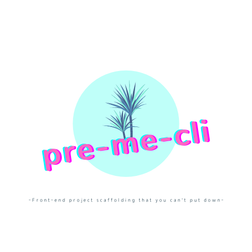

# pre-me-cli👌

> A front-end scaffolding that supports `Webpack / Vite`+`TypeScript`+`React`

 📎[中文｜Chinese](./README_zh.md)

  

## Features🎉

1. Compared to `create-react-app`, it is faster and supports more customization and deployment.
2. Starting from `webpack-dev-server`, you can completely use the method of webpack official website to configure, provide package analysis, and provide users with a better one-stop service.
3. An analysis report is included in the packaged file.
4. With the addition of `postcss`, the mobile terminal can also be developed quickly.
5. Add `eslint` and `prettier` for code specification.
6. Support `Jest` test.
7. Add `git commmit` detection.
8. Support `mock` test.
9. The packaging process and compiling process beautify.

## Update content👏

1. Added the `Vite` template, and modified the state that the process is still running after the `Webpack` package is completed

## Use

1. `npm install pre-me-cli -g`

2. `pre-me-cli init [projectDirName]`
   - `Vite`
   - `Webpack`

## Custom configuration

1. devServer (webpack server configuration)
   -Information such as `Proxy` and `Port` can be configured in the `config.js` file under the `config` folder.

2. Custom path configuration
   -The `resolve -> alias` in the `webpack.base.js` file under the `config` folder can be configured.
   -Need to be configured in `compilerOptions -> paths` in `tsconfig.js` in the root directory.

(More custom configurations are waiting for you to discover)...